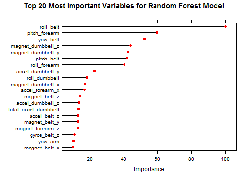
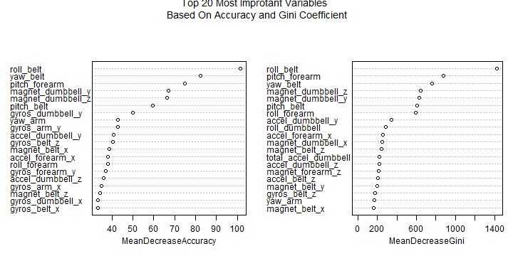
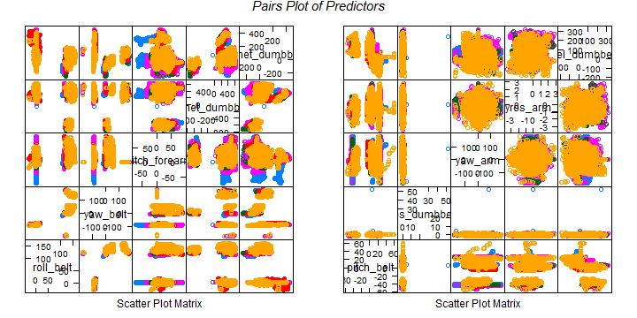

---
## Machine Learning: Qualitative Prediction of Human Activity Based on Weight Lifting Exercises
**Jagan Narayanam**  
*Thursday, January 22, 2015*   
  
---
### Synopsis    

The prediction analysis presented in this report revealed that the "Random Forest" is the best approach (one of the best) compared to "glm (generalized linear model)", "lda (linear discriminent analysis)", "rpart (decision trees)" and "pca (Principal Component Analysis)". The data used for this analysis is the data from accelerometers on the belt, forearm, arm, and dumbell of 6 participants, contained 19622 observations and 160 variables. As a first step in this analysis, the data was processed to get a tidy data set. Removal of variables containing "NA" and "" provided the tidy data set. This training data set was then partitioned to train and validation data sets. Finally, various regression models applied (vide supra) and realized the "Random Forest" approach is the best with all the variables as predictors (accuracy 99.8%). However, based on variable importance the number of variables used in the model reduced to 15, without compromising much interms of accuracy (98.6%) and error (1.39%). Whereas "glm", "lda" and "rpart" did not cross 70% of accuracy and PCA model requires 36 components to capture the 99% of variance. Finally, based on this analysis, "random forest" approach with 15 variables is practically viable approach to predict the human activity based on wieght lifting exercises.    

### Data Loading and Processing  


```r
url <- "http://d396qusza40orc.cloudfront.net/predmachlearn/pml-training.csv"
download.file(url, destfile = "pml-training.csv", mode = "wb")
training <- read.csv("pml-training.csv", header = TRUE, sep = ",")
url1 <- "http://d396qusza40orc.cloudfront.net/predmachlearn/pml-testing.csv"
download.file(url1, destfile = "pml-testing.csv", mode = "wb")
testing <- read.csv("pml-testing.csv", header = TRUE, sep = ",")

# removing columns with NA values
training_1 <- training[, !is.na(training[1, ])]

# removing columns which has very low number of observations i.e. with no values
training_2 <- training_1[, training_1[1, ] != ""]

# removing the variables that belong to names, time etc..
train <- training_2[, -c(1:7)]
```

### Partitioning Training Data


```r
library(caret)
set.seed(1)
inTrain <- createDataPartition(train$classe, p = 0.7, list = FALSE)
train_1 <- train[inTrain, ]
validation <- train[-inTrain, ]
```

### Prediction Modeling:   

The dataset train_1 was used as training set to predict the human activity based on weight lifting exercises. Initially the models like "glm", "lda" and "rpart" were treid and realized that the accuracy with the training set itself did not go more than 70% (considering the space, the details of these approaches are not given). Hence, the models "rf" (randomForest) and "pca" (principal component analysis) were considered for this analysis.  


#### Random Forest Approach:

One of the advantages of random forest approach is that it operates cross validation internally and no need to specify the method (cross validation (cv)) explicitly. In this approach, the model can be built using train() function from caret package or randomForest() function from randomForest package. Both methods were treid and found that the later approach needs far lesser time than the first approach. As a first step, train function used with all the variables as  predictors.  


```r
library(randomForest)
set.seed(101)
fit_rf <- train(classe~., train_1, method = "rf")
fit_rf$finalModel
```

```
## 
## Call:
##  randomForest(x = x, y = y, mtry = param$mtry) 
##                Type of random forest: classification
##                      Number of trees: 500
## No. of variables tried at each split: 27
## 
##         OOB estimate of  error rate: 0.76%
## Confusion matrix:
##      A    B    C    D    E class.error
## A 3896    8    1    0    1 0.002560164
## B   19 2629    9    0    1 0.010910459
## C    0   14 2372   10    0 0.010016694
## D    0    2   24 2224    2 0.012433393
## E    0    1    4    9 2511 0.005544554
```

```r
fit_rf$results
```

```
##   mtry  Accuracy     Kappa  AccuracySD     KappaSD
## 1    2 0.9887572 0.9857797 0.001854838 0.002344377
## 2   27 0.9895171 0.9867407 0.001722286 0.002179464
## 3   52 0.9811237 0.9761253 0.004331914 0.005475085
```

```r
# Testing on Validation Set
pred_rf_val <- predict(fit_rf, validation)
cm_rf_val <- confusionMatrix(pred_rf_val, validation$classe)
cm_rf_val$table
```

```
##           Reference
## Prediction    A    B    C    D    E
##          A 1670    6    0    0    0
##          B    1 1130    5    0    1
##          C    2    2 1018    4    1
##          D    0    1    3  959    2
##          E    1    0    0    1 1078
```

```r
cm_rf_val$overall
```

```
##       Accuracy          Kappa  AccuracyLower  AccuracyUpper   AccuracyNull 
##      0.9949023      0.9935519      0.9927306      0.9965580      0.2844520 
## AccuracyPValue  McnemarPValue 
##      0.0000000            NaN
```

```r
cm_rf_val$byClass[, 8]
```

```
##  Class: A  Class: B  Class: C  Class: D  Class: E 
## 0.9980928 0.9953117 0.9951752 0.9967970 0.9979434
```

```r
plot(varImp(fit_rf), 20, col = "red", main = "Top 20 Most Important Variables for Random Forest Model")
```

 

The model fit_rf, used all 52 variables as predictors and 27 variables (predictors) considered for each split of tree for the final model. With these the accuracy is 99.3% and the expected out of bag/sample error rate is 0.71%. Testing this model on validation set yielded the accuracy (99.5) and the error rate (0.5%) similar to that of training set. The out of bag error rate is equal to the estiamte of test error rate. Although, this method provided >99% accuracy, it suffers from the following issues:  
1. requires all 52 variables to predit the human activity correctly.   
2. requires lot of computational time.  
3. practically not a viable approach  

The above issues can be solved by reducing the number of predictors and/or by changing the method for the model. It was observed that use of randomForest() function for the same model decreased the computational time enormously. Based on the Variable Importance Plot, it is evident that only some of the variables (predictors) have high impact on the outcome.  


```r
set.seed(102)
fit_RF <- randomForest(classe ~ ., data = train_1, mtry = 27, importance = TRUE)
fit_RF
```

```
## 
## Call:
##  randomForest(formula = classe ~ ., data = train_1, mtry = 27,      importance = TRUE) 
##                Type of random forest: classification
##                      Number of trees: 500
## No. of variables tried at each split: 27
## 
##         OOB estimate of  error rate: 0.71%
## Confusion matrix:
##      A    B    C    D    E class.error
## A 3895    9    1    0    1 0.002816180
## B   18 2634    6    0    0 0.009029345
## C    0   15 2371    9    1 0.010434057
## D    0    2   23 2225    2 0.011989343
## E    0    1    4    6 2514 0.004356436
```

```r
varImpPlot(fit_RF, n.var = 20, 
           main = "Top 20 Most Improtant Variables \n Based On Accuracy and Gini Coefficient") 
```

 

It is clearly evident that both the models provided almost identical results. In addition, plotting "variable Importance" provided the much needed information regarding the predictors that are contributing most to the model. Comparing the two plots, it is observed that the top 20 variables in plot 1 (fit_rf) and plot 2 are same. So, it is more appropriate to select the predictors from those varaibles. To reduce the number of predictors in the model, various models with different number of predictors ranging from 20 to 10 were tried. The model with 12 predictors yielded the out of bag/sample test error rate (0.71%) that is identical to the model with 52 predictors. However, the top 10 variables with highest mean decrease in Accuracy were selected to fit the model, with almost same accuracy 99.1% (with 0.89% out of bag/sample error rate).       


```r
# subsetting the data based on Importance
imp <- as.data.frame(importance(fit_RF))
imp$rownames <- row.names(imp) 
library(dplyr)

imp <- imp %>% arrange(desc(MeanDecreaseAccuracy))
Acc <- train_1[, imp$rownames[1:10]]
Acc$classe <- train_1$classe

set.seed(103)
Acc_rf <- randomForest(classe~., data = Acc, importance = TRUE)
Acc_rf
```

```
## 
## Call:
##  randomForest(formula = classe ~ ., data = Acc, importance = TRUE) 
##                Type of random forest: classification
##                      Number of trees: 500
## No. of variables tried at each split: 3
## 
##         OOB estimate of  error rate: 1.01%
## Confusion matrix:
##      A    B    C    D    E class.error
## A 3894    5    3    3    1 0.003072197
## B   17 2604   36    0    1 0.020316027
## C    1    9 2374   12    0 0.009181970
## D    1    1   16 2233    1 0.008436945
## E    0   13   11    8 2493 0.012673267
```

The results are very encouraging as they are on par with the model that used all 52 varaiables (fit_rf and fit_RF). The model with 10 predictors not only reduced the number of varaibles required for the prediction model and also the computational time decreased phonomenally, requires just less than a minute. In addition, the performance of this model on the validation set is as accurate (accuracy 99.2% and out of bag/sample error rate 0.8%) as it did on the training set.     


```r
# Predictions with validation Set
pred_rf_val <- predict(Acc_rf, newdata = validation)
cm_Acc_val <- confusionMatrix(pred_rf_val, validation$classe)
cm_Acc_val$table
```

```
##           Reference
## Prediction    A    B    C    D    E
##          A 1671   10    0    0    0
##          B    3 1115    4    1    1
##          C    0   11 1018    3    3
##          D    0    2    3  957    1
##          E    0    1    1    3 1077
```

```r
cm_Acc_val$overall
```

```
##       Accuracy          Kappa  AccuracyLower  AccuracyUpper   AccuracyNull 
##      0.9920136      0.9898972      0.9893938      0.9941262      0.2844520 
## AccuracyPValue  McnemarPValue 
##      0.0000000            NaN
```

```r
cm_Acc_val$byClass[, 8]
```

```
##  Class: A  Class: B  Class: C  Class: D  Class: E 
## 0.9979166 0.9885163 0.9943520 0.9957597 0.9971690
```

Due to the reasons specified above, the model Acc_rf conisdered as one of the best models to predict the human activity based on weight lifting exercises. So, Acc_rf model was used to predict the human activity using testing data set.    


```r
pred_Acc <- predict(Acc_rf, newdata = testing)
pred_rf <- predict(fit_rf, newdata = testing)
pred_RF <- predict(fit_RF, newdata = testing)
pred_Acc
```

```
##  1  2  3  4  5  6  7  8  9 10 11 12 13 14 15 16 17 18 19 20 
##  B  A  B  A  A  E  D  B  A  A  B  C  B  A  E  E  A  B  B  B 
## Levels: A B C D E
```

```r
pred_rf
```

```
##  [1] B A B A A E D B A A B C B A E E A B B B
## Levels: A B C D E
```

```r
pred_RF
```

```
##  1  2  3  4  5  6  7  8  9 10 11 12 13 14 15 16 17 18 19 20 
##  B  A  B  A  A  E  D  B  A  A  B  C  B  A  E  E  A  B  B  B 
## Levels: A B C D E
```

It's worth to note that all of the models provided the same results and all of them are correct (according to the project submission assignment) for all the test cases. I guess it might be a special set of test cases.     

### Interpretation and Analysis:  

Interpreting the final model even after reducing the number of predictors to 10 variables, still seems to be complex. The "pairs" plots seem to be tricky to come up with a correlation between predictors and the classe variable. This can be clearly explained by the classe variable, which has five different classes. It is very difficult to differentiate between these classes just by two or three variables. However, this model clearly explains that to predict the type of human activity it only requires 10 variables that are used in Acc_rf model.     


```r
library(gridExtra)
```

```
## Loading required package: grid
```

```r
pp_1 <- featurePlot(Acc[, 1:5], Acc$classe, plot = "pairs")
pp_2 <- featurePlot(Acc[, 6:10], Acc$classe, plot = "pairs")
grid.arrange(arrangeGrob(pp_1, pp_2, ncol = 2), 
             main = textGrob("Pairs Plot of Predictors", 
                             gp=gpar(fontsize=15,font=3)))
```

 

#### Other Methods: Principal Component Analysis

Principal Component Analysis is one of the first methods that can perform regression using dimensionality reduction. So, principal component analysis (PCA) was also performed for human activity recognition. However, it revelaed that PCA method requires 36 components to capture 99% of variance, and fitting the model with "rf" method gave the error rate 2.11% which is higher than any other model described above. Hence, PCA approach did not consider for predicting human activity of testing set.


```r
fit_pca_99 <- preProcess(train_1[, -53], method = "pca", thresh = 0.99) # capturing upto 99% variance
fit_pca_99$numComp
```

```
## [1] 36
```

```r
fit_pca_95 <- preProcess(train_1[, -53], method = "pca", thresh = 0.95) # capturing upto 95% variance
fit_pca_95$numComp
```

```
## [1] 25
```

```r
fit_pca_90 <- preProcess(train_1[, -53], method = "pca", thresh = 0.90) # capturing upto 90% variance
fit_pca_90$numComp
```

```
## [1] 18
```

```r
# creating data set with principal components
pca_99_train <- predict(fit_pca_99, train_1[, -53])
pca_99_train$classe <- train_1$classe
set.seed(104)
fit_pca_rf <- train(classe~., data = pca_99_train, method = "rf")
fit_pca_rf$finalModel
```

```
## 
## Call:
##  randomForest(x = x, y = y, mtry = param$mtry) 
##                Type of random forest: classification
##                      Number of trees: 500
## No. of variables tried at each split: 2
## 
##         OOB estimate of  error rate: 2.11%
## Confusion matrix:
##      A    B    C    D    E class.error
## A 3895    4    2    2    3  0.00281618
## B   60 2572   25    1    0  0.03235515
## C    2   26 2348   15    5  0.02003339
## D    3    1   97 2147    4  0.04662522
## E    0    6   24   10 2485  0.01584158
```

### Conclusions  

Human activity recognition using weight lifting exercises using "Machine Learning" techniques were studied. "Random Forest" method found to be the best approach with lowest out of bag/sample error rate. The other methods such as "glm", "lda", "rpart" (Decision Trees) and "pca" (Principal Component Analysis) proved to be inferior to the "random Forest" approach. The analysis realized that the final model provided >99% accuracy  with just 0.89% out of sample test error rate and required only 10 variables as predictors. The final model predicted the test cases with 100% accuracy.  


